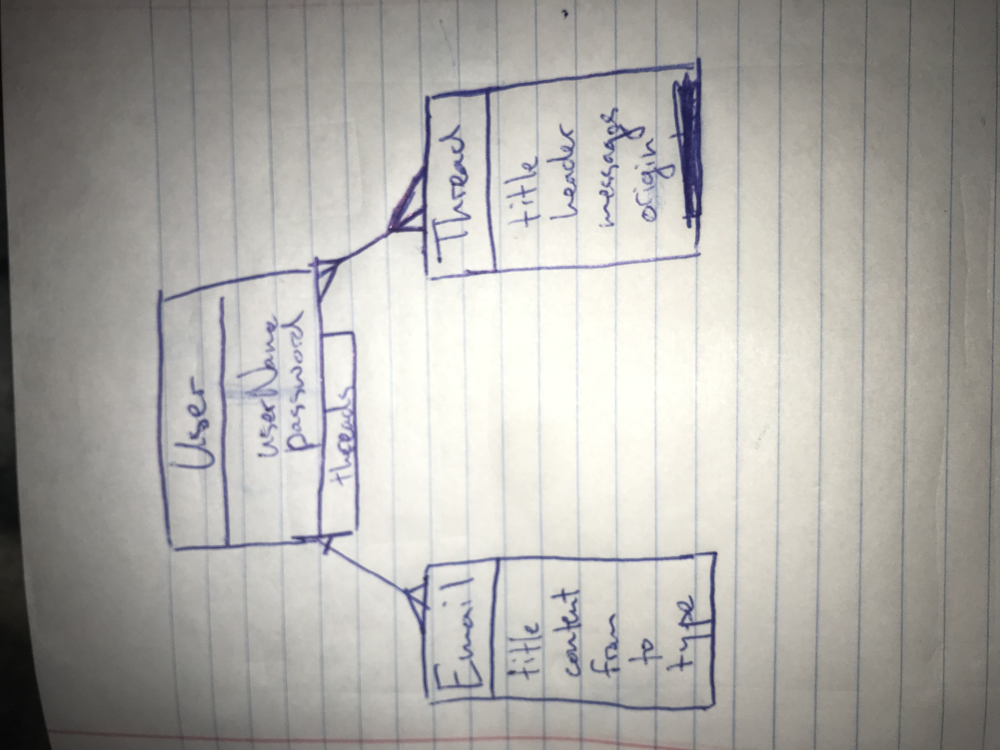
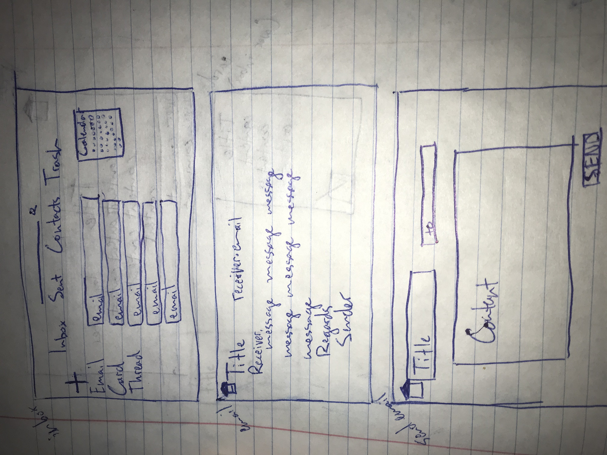

In today's world software security and privacy are concerns that are increasingly disregarded, as social network companies sell their users' browsing data to interested third parties.
My mail app is meant to fill that role, and its users can ease their minds knowing that their internet behavior, or any data relating to them personally, is not being sold.

[Trello Project board](https://trello.com/b/OyHMo8EW/email)

ERD

Wireframe

